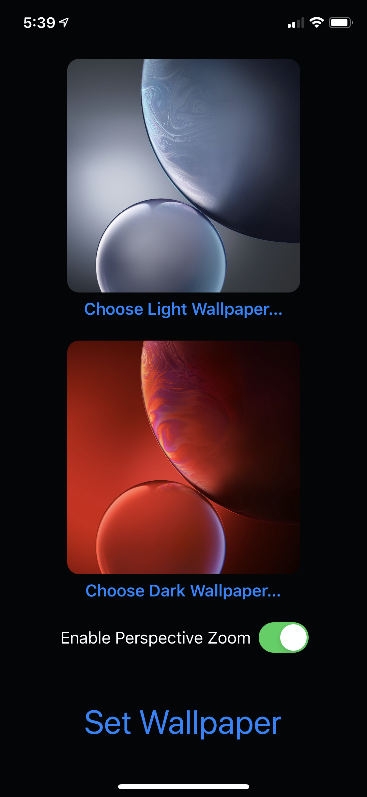

# Set Light and Dark Mode Wallpapers for iOS 13

This is a proof-of-concept app that allows you to set separate light and dark wallpapers, just like the Shortcuts app allowed, before it was removed.

This was achieved through reverse-engineering Apple's private frameworks. The relevant ones were: "SpringBoardFoundation.framework", and "SpringBoardUIServices.framework".

Basically the trick that took me forever to figure out was the missing private entitlement `com.apple.springboard.wallpaper-access`. Because that entitlement is required, this app can't be built and signed onto a real device, only the Simulator and Jailbroken devices :(

